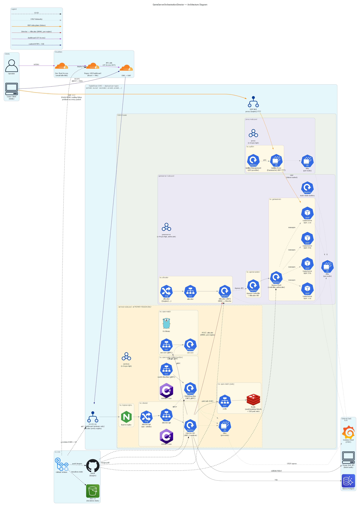

# Game Server Orchestration Platform Overview

Game server orchestration platform for a multiplayer FPS, built on Kubernetes. A .NET Director API coordinates matchmaking via OpenMatch. Regional Allocators handle game server allocation through Agones, and Quilkin proxies route public UDP. Every region runs game server infrastructure while core services are centralised in the primary region.

## Architecture



## What it does

Players authenticate via Steam, queue through OpenMatch, and connect to dedicated game server pods managed by Agones.

```
Player              Director API            OpenMatch         Redis        Allocator
  |                      |                      |                |              |
  |-- Login ------------>|                      |                |              |
  |<-- JWT --------------|                      |                |              |
  |                      |                      |                |              |
  |-- SSE Connect ------>|                      |                |              |
  |<-- state: none ------|                      |                |              |
  |                      |                      |                |              |
  |-- Start Queue ------>|-- Create Ticket ---->|                |              |
  |                      |-- Publish: queued ------------------->|              |
  |<-- state: queued ----|<--------------------- Subscribe ------|              |
  |                      |                      |                |              |
  |     (waiting)        |                      |                |              |
  |                      |<-- Match Found ------|                |              |
  |                      |                      |                |              |
  |                      |-- Allocate Server ---------------------------------->|
  |                      |<-- Regional proxy domain + routing token ------------|
  |                      |                      |                |              |
  |                      |-- Publish: matched ------------------>|              |
  |<-- state: matched ---|<--------------------- Push -----------|              |
  |                      |                      |                |              |
  |-- Join Session ----->|                      |                |              |
  |<-- Connection Info --|                      |                |              |
  |                      |                      |                |              |
  |=================== Connect to Game Server =================================>|
```

## Design notes

- **Quilkin UDP proxy with HMAC routing tokens.** UDP cannot be terminated and reissued by a normal L7 load balancer, and exposing GameServer pods directly is not ideal. An 8 byte HMAC token is prefixed on each client UDP packet; Quilkin validates and strips it before forwarding to the bound game server.
- **Region topology.** Every region runs the same cluster template, but the services node pool (Director API, OpenMatch, Redis) only deploys in the primary region as matchmaking is global. Allocators run per region for fast game server allocation.
- **OpenMatch 2 and Agones.** OpenMatch handles matchmaking via a custom MatchFunction (gRPC, .NET); Agones manages GameServer pod lifecycle, scaling, and allocation.
- **SSE over Redis pub/sub.** Push channel for player state changes without polling. One connection per player; new connections evict existing ones. Redis fans out state transitions across Director API replicas.
- **Server to server auth via HMAC.** Game servers authenticate to the Director via HMAC challenge response, receiving a JWT for session calls. Director to Allocator calls across regions are HMAC signed with per region keys.
- **Cloudflare Zero Trust Access for the operations dashboard.** Identity verified at the edge via signed JWT, validated by the Director. Email allowlist gates access.
- **Telemetry via Grafana Alloy.** DaemonSet on every node collects OpenTelemetry traces, metrics, and logs and ships to Grafana Cloud.

## Alternatives considered

- **Primary vs multi region service pool.** The service layer (Director, OpenMatch, Redis) runs only in the primary region. Replicating it per region would fragment the matchmaking pool and require synchronising state across regions; region affinity is handled as an OpenMatch pool filter instead.
- **Quilkin on a dedicated proxy node pool vs colocated with game servers.** Colocating the proxy with game server pods exposes the gameserver nodes directly to public UDP. The dedicated proxy pool absorbs that traffic, validates HMAC tokens, and drops bad packets before anything reaches the gameservers.
- **Terraform managed Fleet vs kubectl managed.** The Agones Fleet manages ephemeral, session based game servers that are constantly created, allocated, and torn down, so does not belong in Terraform state with persistent infrastructure. The manifest is applied via kubectl through a dedicated workflow instead.
- **DOKS vs cheaper providers.** Originally hosted on Vultr for cost, but the managed Kubernetes control plane and LoadBalancer provisioning was unreliable. DOKS trades a small price increase for stable cluster behaviour and reliable UDP LoadBalancers.

## Known limitations

- **Primary region control plane is a single point of failure for new matchmaking.** If the primary region is down, in progress matches in other regions continue but new matchmaking pauses until it recovers. Redis state (SSE channels, OpenMatch tickets) is ephemeral, and stale player session state is cleaned up automatically once the region returns.
- **No automated cluster failover.** Currently if a regional cluster is unavailable, players are matched into other regions with worse ping. There is no automated drain or detection, removing a region from rotation is a manual operation.

## Tech stack

| Layer | |
|---|---|
| API / Allocator / MatchFunction | .NET 10, ASP.NET Core, gRPC |
| Dashboard | React, TypeScript, Vite, TanStack Query |
| Database | Postgres (Aurora) |
| Messaging | Redis (matchmaking tickets and SSE pub/sub) |
| Matchmaking | OpenMatch 2 |
| Orchestration | Kubernetes (DigitalOcean DOKS), Agones |
| UDP proxy | Quilkin |
| Edge | Cloudflare (DNS, Pages, Zero Trust Access, WAF) |
| Auth | Steam Web API, JWT |
| IaC / CI | Terraform, GitHub Actions, GHCR, AWS S3 (tf state) |
| Observability | OpenTelemetry, Grafana Alloy, Grafana Cloud |

## Repository note

Implementation repo is private, this repo is an architectural overview only. 
